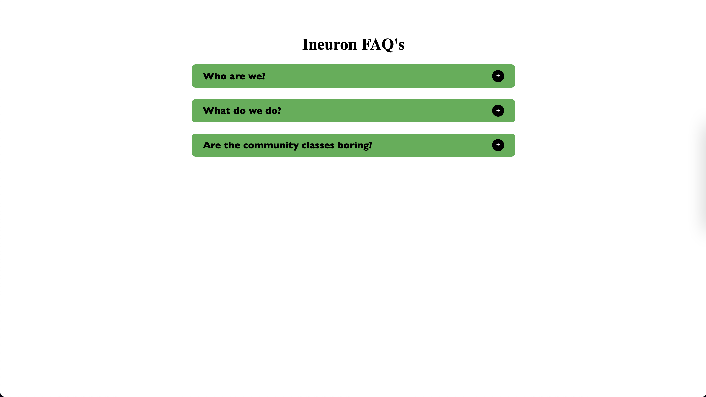

## Hi, I'm Sudhansu Sekhar Mahankuda ! 👋

### 🚀 I'm a front-end developer...

# Accordion

- This is my first project using **JavaScript**, in this project when we hover the mouse on each "+" icons the hidden text will shown.

---

## Learnt from this Project

- Inserting html

- remove and add class

---

- It took me around 1 hours to make this project .

## 🛠 Skills
HTML, CSS, JavaScript

[LinkedIn](https://www.linkedin.com/posts/sud-sekhar_accordion-activity-7035795178036613120-X-AO?utm_source=share&utm_medium=member_desktop)

[Netlify](https://accordion-sud.netlify.app/)

